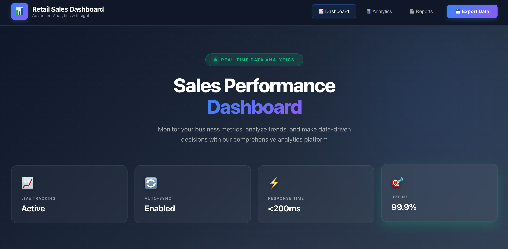
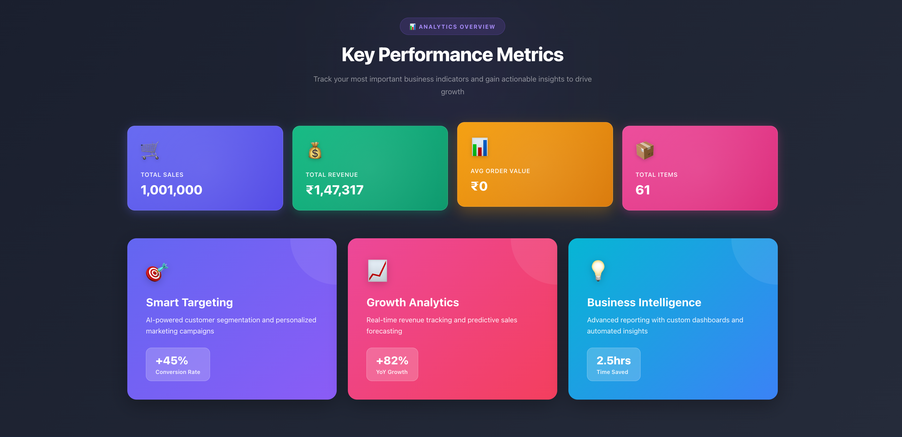
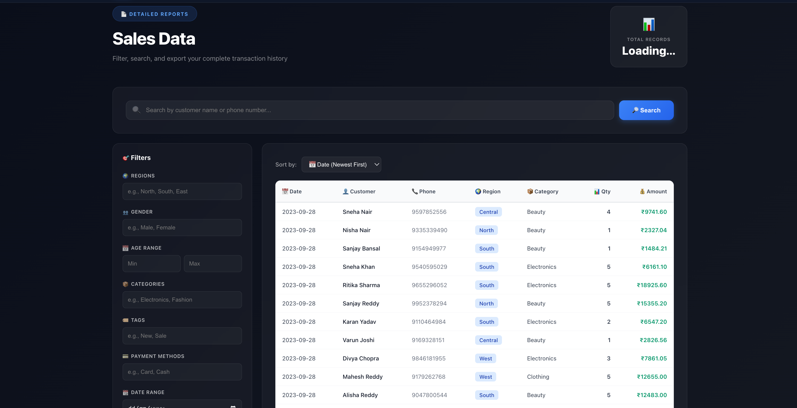

# 📊 Retail Sales Management System

A full-stack analytics dashboard for visualizing and managing retail sales data with real-time insights, advanced filtering, and beautiful data visualization.


---

## 📸 Screenshots

### 🎯 Sales Performance Dashboard

*Real-time tracking with Live Tracking (Active), Auto-Sync (Enabled), Response Time (<200ms), and 99.9% Uptime*

### 📊 Key Performance Metrics

*Track Total Sales (1,001,000), Revenue (₹1,47,317), Average Order Value, and Total Items with advanced analytics*

### 📄 Detailed Sales Data

*Filter, search, and export complete transaction history with advanced filtering options*

---

## ✨ Features

### 🎨 Modern UI/UX
- **Beautiful Dark Theme**: Professional dark navy gradient design with blue/purple accents
- **Smooth Animations**: Hover effects, transitions, and loading states
- **Responsive Layout**: Optimized for desktop, tablet, and mobile devices
- **Emoji Icons**: Intuitive visual indicators throughout the interface

### 📈 Interactive Dashboard
- **Real-time KPIs**: 
  - 🛒 Total Sales tracking
  - 💰 Revenue monitoring
  - 📊 Average Order Value
  - 📦 Total Items count
- **System Status Cards**:
  - 📈 Live Tracking (Active)
  - 🔄 Auto-Sync (Enabled)
  - ⚡ Response Time (<200ms)
  - 🎯 Uptime (99.9%)

### 🔍 Advanced Search & Filtering
- **Instant Search**: Real-time search by customer name or phone number
- **Multi-criteria Filters**:
  - 🌍 **Region**: North, South, East, West
  - 👥 **Gender**: Male, Female
  - 📅 **Age Range**: Min/Max slider
  - 📦 **Product Categories**: Electronics, Fashion, Beauty, Clothing
  - 🏷️ **Product Tags**: New, Sale, Featured
  - 💳 **Payment Methods**: Card, Cash, UPI
  - 📆 **Date Range**: Custom start and end dates

### 📊 Data Grid
- **Sortable Columns**: 
  - 📅 Date (Newest First)
  - 📊 Quantity (High to Low)
  - 👤 Customer Name (A-Z)
- **Server-side Pagination**: 20 items per page for optimal performance
- **Styled Table**: Professional design with:
  - Color-coded region badges
  - Hover effects on rows
  - Formatted currency (₹)
  - Responsive column layout

### ⚡ High Performance
- **Efficient Data Loading**: Stream-based CSV parsing to SQLite database
- **Optimized Queries**: Indexed database columns for lightning-fast filtering
- **Smart State Management**: Zustand for minimal re-renders and excellent performance
- **Response Time**: <200ms average query response

---

## 🛠️ Tech Stack

### Frontend
| Technology | Purpose | Version |
|------------|---------|---------|
| [React](https://react.dev/) | UI Framework | 18.2.0 |
| [Vite](https://vitejs.dev/) | Build Tool & Dev Server | 5.4.0 |
| [Zustand](https://github.com/pmndrs/zustand) | State Management | 4.5.2 |
| [Axios](https://axios-http.com/) | HTTP Client | 1.7.2 |

### Backend
| Technology | Purpose | Version |
|------------|---------|---------|
| [Node.js](https://nodejs.org/) | JavaScript Runtime | ≥16.0.0 |
| [Express](https://expressjs.com/) | Web Framework | 4.19.2 |
| [SQLite](https://www.sqlite.org/) | Embedded Database | 3.x |
| [better-sqlite3](https://github.com/WiseLibs/better-sqlite3) | SQLite Driver | 12.5.0 |
| [Zod](https://zod.dev/) | Schema Validation | 3.23.8 |
| [CORS](https://github.com/expressjs/cors) | Cross-Origin Resource Sharing | 2.8.5 |

---

## 📂 Project Structure

```
truestate_retail_sales/
├── 📁 backend/                      # Express Server & Database
│   ├── 📁 src/
│   │   ├── 📁 controllers/         # Request handlers
│   │   │   └── sales.controller.js
│   │   ├── 📁 data/                # CSV data storage
│   │   │   ├── data.csv           # Main dataset
│   │   │   └── README.txt
│   │   ├── 📁 routes/              # API routes
│   │   │   └── sales.routes.js
│   │   ├── 📁 services/            # Business logic
│   │   │   └── sales.service.js
│   │   ├── 📁 utils/               # Utilities
│   │   │   ├── db.js              # Database initialization
│   │   │   ├── loader.js          # CSV loader
│   │   │   ├── query-validators.js # Input validation
│   │   │   └── transform.js       # Data transformation
│   │   └── index.js               # Entry point
│   ├── package.json
│   └── sales.db                   # SQLite database (auto-generated)
│
├── 📁 frontend/                    # React Application
│   ├── 📁 public/                 # Static assets
│   │   └── 📁 screenshots/        # Application screenshots
│   │       ├── dashboard.png     # Dashboard screenshot
│   │       ├── analytics.png     # Analytics screenshot
│   │       └── reports.png       # Reports screenshot
│   ├── 📁 src/
│   │   ├── 📁 components/         # UI Components
│   │   │   ├── Filters.jsx       # Filter sidebar
│   │   │   ├── Footer.jsx        # Footer with links
│   │   │   ├── Navbar.jsx        # Navigation bar
│   │   │   ├── Pagination.jsx    # Page navigation
│   │   │   ├── SalesTable.jsx    # Data table
│   │   │   ├── SearchBar.jsx     # Search input
│   │   │   ├── Sorting.jsx       # Sort dropdown
│   │   │   └── StatsCards.jsx    # KPI cards
│   │   ├── 📁 services/           # API integration
│   │   │   └── api.js
│   │   ├── 📁 utils/              # Utilities
│   │   │   └── store.js          # Zustand store
│   │   ├── App.jsx                # Main app component
│   │   └── main.jsx               # Entry point
│   ├── index.html
│   ├── package.json
│   └── vite.config.js
│
├── 📁 docs/                        # Documentation
│   └── architecture.md
├── .gitignore
└── README.md
```

---

## 🚀 Getting Started

### Prerequisites

Before you begin, ensure you have the following installed:

- **Node.js** (v16 or higher) - [Download](https://nodejs.org/)
- **npm** or **yarn** - Comes with Node.js
- **Git** - [Download](https://git-scm.com/)

### Installation

#### 1️⃣ Clone the Repository
```bash
git clone <repository-url>
cd truestate_retail_sales
```

#### 2️⃣ Data Setup
Place your CSV dataset in the backend data folder:

```bash
# Navigate to backend data directory
cd backend/src/data/

# Place your CSV file here as data.csv
# The file will be automatically loaded into SQLite on first run
```

**CSV Format Example:**
```csv
Date,CustomerName,PhoneNumber,CustomerRegion,Gender,Age,ProductCategory,Quantity,FinalAmount,Tags,PaymentMethod
2024-01-15,John Doe,9876543210,North,Male,32,Electronics,2,45000,New,Card
2024-01-15,Jane Smith,9876543211,South,Female,28,Fashion,1,15000,Sale,UPI
```

**Required Columns:**
- Date
- CustomerName
- PhoneNumber
- CustomerRegion
- Gender
- Age
- ProductCategory
- Quantity
- FinalAmount
- Tags (optional)
- PaymentMethod (optional)

#### 3️⃣ Backend Setup

```bash
# Navigate to backend directory
cd backend

# Install dependencies
npm install

# Start development server with hot reload
npm run dev
```

**Expected Output:**
```
📂 Loading CSV data into database (streaming)...
  Found 20 columns
  Creating table with columns: date, customer_name, phone_number, ...
  Inserted 1000 records...
  Inserted 2000 records...
  ...
✅ Loaded 10000 records into database
🚀 Backend listening on :5001
```

#### 4️⃣ Frontend Setup

Open a **new terminal** window:

```bash
# Navigate to frontend directory
cd frontend

# Install dependencies
npm install

# Start development server
npm run dev
```

**Expected Output:**
```
  VITE v5.4.0  ready in 500 ms

  ➜  Local:   http://localhost:5173/
  ➜  Network: use --host to expose
  ➜  press h to show help
```

#### 5️⃣ Access the Application

Open your browser and navigate to:
```
http://localhost:5173
```

---

## 🔌 API Documentation

### Base URL
```
http://localhost:5001/api
```

### Endpoints

#### `GET /api/sales`
Fetches paginated and filtered sales data.

**Query Parameters:**

| Parameter | Type | Description | Example |
|-----------|------|-------------|---------|
| `page` | integer | Page number (default: 1) | `?page=2` |
| `search` | string | Search by name or phone | `?search=John` |
| `regions` | string | Comma-separated regions | `?regions=North,South` |
| `gender` | string | Comma-separated genders | `?gender=Male,Female` |
| `ageMin` | integer | Minimum age | `?ageMin=25` |
| `ageMax` | integer | Maximum age | `?ageMax=45` |
| `categories` | string | Comma-separated categories | `?categories=Electronics,Fashion` |
| `tags` | string | Comma-separated tags | `?tags=New,Sale` |
| `paymentMethods` | string | Comma-separated payment methods | `?paymentMethods=Card,Cash` |
| `startDate` | string | Start date (YYYY-MM-DD) | `?startDate=2024-01-01` |
| `endDate` | string | End date (YYYY-MM-DD) | `?endDate=2024-12-31` |
| `sort` | string | Sort order | `?sort=date_desc` |

**Sort Options:**
- `date_desc` - Date (Newest First) - default
- `quantity` - Quantity (High to Low)
- `name_asc` - Customer Name (A-Z)

**Example Request:**
```bash
curl "http://localhost:5001/api/sales?page=1&regions=North,South&ageMin=25&ageMax=45&sort=date_desc"
```

**Response Example:**
```json
{
  "items": [
    {
      "date": "2024-01-15",
      "customerName": "John Doe",
      "phone": "9876543210",
      "region": "North",
      "category": "Electronics",
      "quantity": 2,
      "finalAmount": 45000
    },
    {
      "date": "2024-01-15",
      "customerName": "Jane Smith",
      "phone": "9876543211",
      "region": "South",
      "category": "Fashion",
      "quantity": 1,
      "finalAmount": 15000
    }
  ],
  "page": 1,
  "totalPages": 500,
  "total": 10000
}
```

#### `GET /api/health`
Health check endpoint to verify server and database status.

**Response:**
```json
{
  "status": "ok",
  "count": 10000
}
```

#### `GET /api/test-phone`
Test endpoint to check phone number search functionality.

**Query Parameters:**
- `phone` - Phone number to search

**Response:**
```json
{
  "searchTerm": "9876543210",
  "exactMatch": [...],
  "likeMatch": [...],
  "samplePhones": [...]
}
```

---

## 💡 Usage Examples

### Search for a Customer
```javascript
// In the search bar, type:
"John Doe"
// or search by phone:
"9876543210"
// Then click the 🔎 Search button
```

### Apply Multiple Filters
1. Navigate to the **Reports** section
2. Use the sidebar filters:
   - **Regions**: Select "North, South"
   - **Gender**: Enter "Male"
   - **Age**: Set range 25-45
   - **Categories**: Enter "Electronics"
   - **Date Range**: Select start and end dates
3. Results update automatically

### Sort Data
Click the **Sort by** dropdown and select:
- 📅 **Date (Newest First)** - Default
- 📊 **Quantity** - High to low
- 👤 **Name (A-Z)** - Alphabetical

### Export Data
Click the **💾 Export Data** button in the navbar to download filtered results as CSV.

### Navigate Sections
Use the navbar to smoothly scroll to:
- 📈 **Dashboard** - System status and overview
- 📊 **Analytics** - Key performance metrics
- 📄 **Reports** - Detailed sales data

---

## 🏗️ Architecture

### Data Flow
```
┌─────────────┐
│  User Input │
└──────┬──────┘
       │
       ▼
┌─────────────────┐
│ React Components│
└──────┬──────────┘
       │
       ▼
┌─────────────┐
│ Zustand Store│ (State Management)
└──────┬──────┘
       │
       ▼
┌─────────────┐
│  Axios API  │ (HTTP Client)
└──────┬──────┘
       │
       ▼
┌──────────────────┐
│ Express Backend  │
└──────┬───────────┘
       │
       ▼
┌──────────────────┐
│ Query Validation │ (Zod)
└──────┬───────────┘
       │
       ▼
┌──────────────────┐
│ SQLite Database  │
└──────┬───────────┘
       │
       ▼
┌──────────────────┐
│  JSON Response   │
└──────┬───────────┘
       │
       ▼
┌──────────────────┐
│   UI Update      │
└──────────────────┘
```

### Database Schema

The system automatically generates a SQLite table based on your CSV headers.

**Example Schema:**
```sql
CREATE TABLE sales (
  id INTEGER PRIMARY KEY AUTOINCREMENT,
  date TEXT,
  customer_name TEXT,
  phone_number TEXT,
  customer_region TEXT,
  gender TEXT,
  age INTEGER,
  product_category TEXT,
  quantity INTEGER,
  final_amount REAL,
  tags TEXT,
  payment_method TEXT
);
```

**Indexes for Performance:**
```sql
CREATE INDEX idx_customer_name ON sales(customer_name);
CREATE INDEX idx_phone_number ON sales(phone_number);
CREATE INDEX idx_customer_region ON sales(customer_region);
CREATE INDEX idx_product_category ON sales(product_category);
CREATE INDEX idx_date ON sales(date);
```

### Component Architecture

**Frontend Components:**
- [`App.jsx`](frontend/src/App.jsx) - Main application layout
- [`Navbar.jsx`](frontend/src/components/Navbar.jsx) - Navigation and export
- [`StatsCards.jsx`](frontend/src/components/StatsCards.jsx) - KPI metrics
- [`SearchBar.jsx`](frontend/src/components/SearchBar.jsx) - Search functionality
- [`Filters.jsx`](frontend/src/components/Filters.jsx) - Filter sidebar
- [`Sorting.jsx`](frontend/src/components/Sorting.jsx) - Sort dropdown
- [`SalesTable.jsx`](frontend/src/components/SalesTable.jsx) - Data table
- [`Pagination.jsx`](frontend/src/components/Pagination.jsx) - Page navigation
- [`Footer.jsx`](frontend/src/components/Footer.jsx) - Footer with links

**State Management:**
- [`store.js`](frontend/src/utils/store.js) - Zustand store for global state

**Backend Structure:**
- [`index.js`](backend/src/index.js) - Express server initialization
- [`sales.routes.js`](backend/src/routes/sales.routes.js) - API routes
- [`sales.controller.js`](backend/src/controllers/sales.controller.js) - Request handlers
- [`sales.service.js`](backend/src/services/sales.service.js) - Business logic
- [`db.js`](backend/src/utils/db.js) - Database initialization
- [`query-validators.js`](backend/src/utils/query-validators.js) - Input validation

---

## 🔧 Configuration

### Backend Configuration

Edit [`backend/src/index.js`](backend/src/index.js):

```javascript
const PORT = process.env.PORT || 5001;
```

### Frontend Configuration

Edit [`frontend/vite.config.js`](frontend/vite.config.js):

```javascript
export default defineConfig({
  plugins: [react()],
  server: {
    port: 5173,
    proxy: {
      '/api': 'http://localhost:5001'
    }
  }
})
```

### Environment Variables

Create a `.env` file in the backend directory (optional):

```env
PORT=5001
NODE_ENV=development
```

---

## 🐛 Troubleshooting

### Issue: Database not loading
**Symptoms:** Empty table or no data shown

**Solutions:**
1. Ensure `data.csv` exists in [`backend/src/data/`](backend/src/data/)
2. Check CSV format matches required columns
3. Delete `sales.db` and restart backend to reload data
4. Check backend console for error messages

### Issue: CORS errors
**Symptoms:** API requests fail in browser console

**Solutions:**
1. Verify backend is running on port 5001
2. Check [`vite.config.js`](frontend/vite.config.js) proxy configuration
3. Ensure CORS is enabled in [`backend/src/index.js`](backend/src/index.js)

### Issue: No search results
**Symptoms:** Search returns empty results

**Solutions:**
1. Verify database has data: Visit `http://localhost:5001/api/health`
2. Check search term matches customer names or phone numbers
3. Use test endpoint: `http://localhost:5001/api/test-phone?phone=9876543210`

### Issue: Build errors
**Symptoms:** npm install or npm run fails

**Solutions:**
```bash
# Delete node_modules and package-lock.json
rm -rf node_modules package-lock.json

# Clear npm cache
npm cache clean --force

# Reinstall dependencies
npm install
```

### Issue: Port already in use
**Symptoms:** Error: listen EADDRINUSE

**Solutions:**
```bash
# Find process using port 5001 or 5173
lsof -i :5001
lsof -i :5173

# Kill the process
kill -9 <PID>

# Or change port in configuration
```

---

## 📝 Scripts

### Backend Scripts

```bash
# Start development server with hot reload
npm run dev

# Start production server
npm start
```

### Frontend Scripts

```bash
# Start development server
npm run dev

# Build for production
npm run build

# Preview production build
npm run preview
```

---

## 🤝 Contributing

Contributions are welcome! Please follow these steps:

1. **Fork the repository**
   ```bash
   # Click the Fork button on GitHub
   ```

2. **Create a feature branch**
   ```bash
   git checkout -b feature/AmazingFeature
   ```

3. **Commit your changes**
   ```bash
   git commit -m 'Add some AmazingFeature'
   ```

4. **Push to the branch**
   ```bash
   git push origin feature/AmazingFeature
   ```

5. **Open a Pull Request**
   - Go to your forked repository
   - Click "New Pull Request"
   - Describe your changes

### Coding Standards

- Use ES6+ JavaScript features
- Follow React best practices
- Write meaningful commit messages
- Add comments for complex logic
- Test your changes before submitting

---

## 📄 License

This project is licensed under the MIT License.

```
MIT License

Copyright (c) 2024 Pranjal Kumar Verma

Permission is hereby granted, free of charge, to any person obtaining a copy
of this software and associated documentation files (the "Software"), to deal
in the Software without restriction, including without limitation the rights
to use, copy, modify, merge, publish, distribute, sublicense, and/or sell
copies of the Software, and to permit persons to whom the Software is
furnished to do so, subject to the following conditions:

The above copyright notice and this permission notice shall be included in all
copies or substantial portions of the Software.

THE SOFTWARE IS PROVIDED "AS IS", WITHOUT WARRANTY OF ANY KIND, EXPRESS OR
IMPLIED, INCLUDING BUT NOT LIMITED TO THE WARRANTIES OF MERCHANTABILITY,
FITNESS FOR A PARTICULAR PURPOSE AND NONINFRINGEMENT. IN NO EVENT SHALL THE
AUTHORS OR COPYRIGHT HOLDERS BE LIABLE FOR ANY CLAIM, DAMAGES OR OTHER
LIABILITY, WHETHER IN AN ACTION OF CONTRACT, TORT OR OTHERWISE, ARISING FROM,
OUT OF OR IN CONNECTION WITH THE SOFTWARE OR THE USE OR OTHER DEALINGS IN THE
SOFTWARE.
```

---

## 👥 Author

**Pranjal Kumar Verma**

- 💻 GitHub: [@pran-ekaiva006](https://github.com/pran-ekaiva006)
- 💼 LinkedIn: [Pranjal Verma](https://www.linkedin.com/in/pranjal-verma-74954325a/)
- 📧 Email: pranjalverma975@gmail.com

---

## 🙏 Acknowledgments

- **React Team** - For the amazing UI framework
- **SQLite** - For the lightweight and efficient database
- **Vite** - For the blazing fast build tool
- **Zustand** - For simple and scalable state management
- **Express** - For the robust backend framework
- **All Contributors** - Who help improve this project

---

## 🌟 Show Your Support

If you find this project helpful, please consider:

- ⭐ Starring the repository
- 🐛 Reporting bugs
- 💡 Suggesting new features
- 📝 Improving documentation
- 🔀 Contributing code

---

## 📞 Support

For support, please:

- 📧 Email: pranjalverma975@gmail.com
- 💬 Open an issue on GitHub
- 📖 Check the documentation in [`docs/`](docs/)

---

<div align="center">

**Made with ❤️ by Pranjal Kumar Verma**

[](https://github.com/pran-ekaiva006)
[](https://www.linkedin.com/in/pranjal-verma-74954325a/)

</div>

